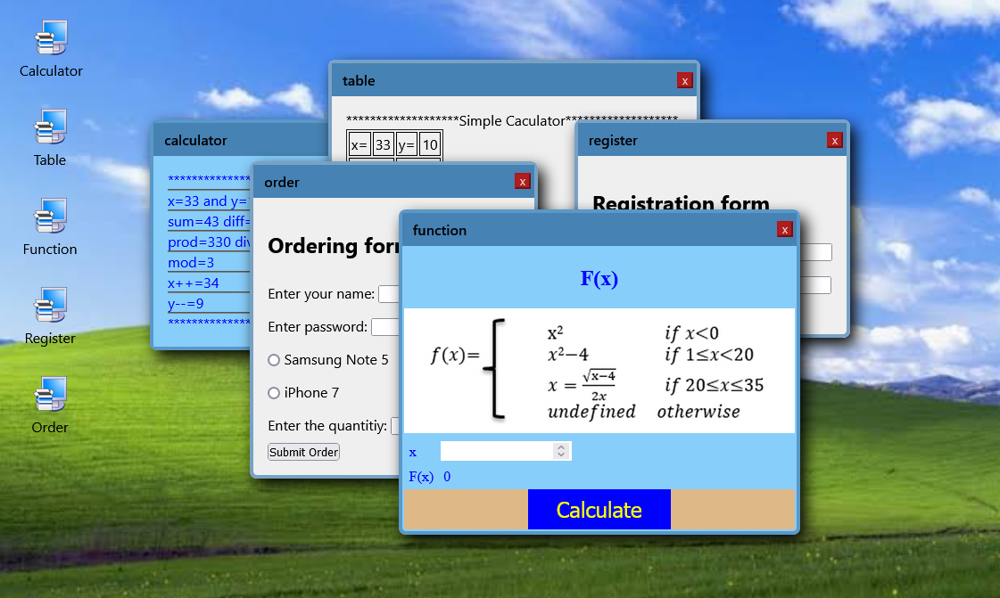

# Comp206 | Javascript Sheet 1

Welcome I am [Samir Ahmad](https://github.com/SamirAhmad5445) and this is a solution to [js sheet 1](https://drive.google.com/file/d/1lOjS_C1OZBSSuOQcADZ3qUh7yHsG3100/view) from course comp206 or web development Dr.Mohammad Hashem.

## Table of contents

- [Overview](#overview)
  - [Screenshot](#screenshot)
  - [Go To Live Page](https://samirahmad5445.github.io/comp206-Sheet-1/)
  - [Where did the idea came from?](#where-did-the-idea-came-from)
- [My Process](#my-process)
  - [HTML](#html)
  - [SASS](#sass)
  - [Javascript](#javascript)
- [My Accounts](#my-accounts)
  - [Gmaill](mailto:samirahmad5445@gmail.com)
  - [GitHub](https://github.com/SamirAhmad5445)
  - [Codepen](https://codepen.io/Samir-Ahmad/)

### Screenshot



### [Go To Live Page](https://samirahmad5445.github.io/comp206-Sheet-1/)

### Where did the idea came from?

The main idea was from codepen where some guy do cool effect on mousemove and the pen was on windows 8 theme while i was trying to code some thing like that i have been seen the sheet so the idea came from there.

### My Process

Here some code snippets from the sheet

### HTML

This code change the image without any js or css using srcset

```html
<div class="icon-image">
  
</div>
```

### Sass

A function take a color and return it in the hsl() formate

```scss
@function color($clr, $alpha: 1) {
  $h: hue($clr);
  $s: saturation($clr);
  $l: lightness($clr);
  @return hsl($h, $s, $l, $alpha);
}
```

### Javascript

Here is how to make things more accessable with a simle Event Listener

```js
icons.forEach((icon) => {
  icon.addEventListener("click", () => {
    openApp(icon.getAttribute("data-index"));
  });
  icon.addEventListener("keypress", (event) => {
    if (event.key === "Enter") {
      openApp(icon.getAttribute("data-index"));
    }
  });
});
```

## My Accounts

- Gmaill - [samirahmad5445@gmail.com](samirahmad5445@gmail.com)
- GitHub - [@SamirAhmad5445](https://github.com/SamirAhmad5445)
- Codepen - [@SamirAhmad5445](https://codepen.io/Samir-Ahmad/)
